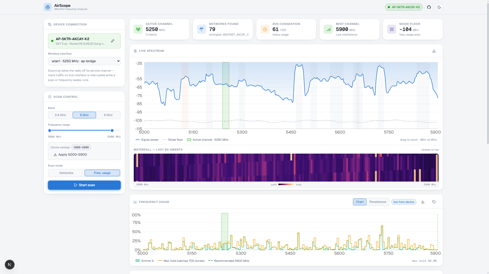
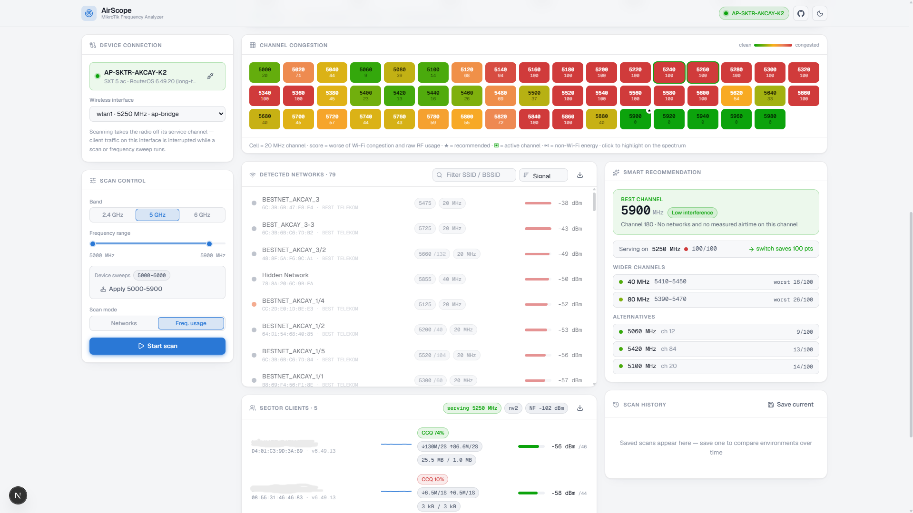

# AirScope — MikroTik Frequency Analyzer

A visual frequency-scanning dashboard for MikroTik devices, built for WISP
operators. It replaces the raw tables of Winbox Scan / Spectral Scan with a
live spectrum chart, a channel-congestion heatmap, and an automatic
channel recommendation engine.






## Features

- **Device connection panel** — RouterOS API (port 8728) with saved device
  profiles, live status indicator, and wireless-interface picker. Supports
  both the legacy `wireless` and RouterOS v7 `wifi` packages.
- **Two scan modes, both continuous** (they time-share the radio):
  - **Networks** — a Winbox-style scanner stream that accumulates every AP
    it hears (150+ entries build up over a minute on a busy site). Tries
    `background=yes` first so clients stay connected; falls back to a
    foreground scan on radio modes that refuse it (station, nv2).
  - **Freq. usage** — the Winbox "Freq. Usage" tool as a live stream:
    real per-frequency airtime % and noise floor, accumulated server-side
    while the radio sweeps the band (~200 bins in 45–60 s, then refreshes).
    Every bin also keeps a **max-hold peak** across sweeps, so TDD/bursty
    transmitters that happen to be idle during one sweep's dwell still
    register; channel scores and interference detection use the peaks.
    A reset button starts a fresh observation window.
- **Persistence (CDF) view** — a Mimosa-style display: each frequency
  column is colored by how *often* every airtime level occurs (red =
  always, purple = rare bursts), from per-bin occurrence histograms
  accumulated server-side. Separates a constantly busy channel from an
  intermittent TDD transmitter at a glance. Toggle inside the Frequency
  usage card.
- **Live spectrum graph** — dBm vs MHz, signal power + noise floor,
  per-network occupancy bands, drag-to-zoom, hover tooltip, PNG export.
- **Spectral waterfall** — scrolling spectrogram of recent sweeps.
- **Channel heatmap** — one cell per 20 MHz channel, green → yellow → red.
  The score is the worse of two independent measurements: Wi-Fi congestion
  (detected networks) and **raw frequency usage** (spectrum energy above the
  noise floor), so channels busy with non-Wi-Fi energy show hot even when no
  network is detected there. Click a cell to highlight it on the spectrum.
- **Non-Wi-Fi interference detection** — spectrum regions whose energy the
  detected networks cannot explain (microwave ovens, radar, analog senders,
  non-802.11 links) are flagged as chips under the heatmap, marked on the
  affected channels, and drawn as dashed bands on the spectrum. Pulsed
  sources are held (max-hold) for a few sweeps so they stay visible.
- **Network list** — SSID, BSSID, frequency/channel, width, security, and a
  signal bar; clicking a row highlights the network on the graph.
- **Smart recommendation** — scores every channel by overlapping signal
  strength and occupancy, suggests the best frequency plus alternates, and
  on contiguous-grid bands also the cleanest **40/80 MHz blocks** (scored
  by their worst member channel).
- **Band + range control** — 2.4 / 5 / 6 GHz toggle with a dual-thumb
  frequency-range slider. The slider filters the view; RouterOS tools
  always sweep the interface's `scan-list`, so the panel shows the
  device's effective sweep range and offers **Apply** (writes
  `scan-list=<min>-<max>` to the device — a narrower list sweeps ~4×
  faster) and **Restore** (puts the remembered original back).
- **Scan control** — start/stop, 1/2/5 s interval, normal vs spectral mode.
- **History & compare** — save scans to local storage and overlay a saved
  scan on the live spectrum.
- **Sector health (non-disruptive)** — the registration table and
  `monitor once` are polled every 2 s without ever taking the radio off its
  service channel: live subscriber list (signal, SNR, CCQ, PHY rates,
  traffic, TDMA stats) with per-client signal sparklines, plus the active
  channel and its real noise floor. The active channel is marked in green
  on the spectrum, the usage chart and the heatmap, and the recommendation
  compares it against the suggested channel ("switch saves N pts").
- **CSV export** for the network list, the usage sweep and the client list;
  PNG export for the spectrum chart. Connection fields persist across
  sessions and successful targets are saved as profiles automatically
  (never passwords).
- **Dark theme by default**, light theme toggle, responsive layout.
- **Cross-mode analysis** — the network list survives switching into usage
  mode and the last usage sweep is held (10 min) when switching back, so
  the recommendation engine always merges both real measurements. On
  connect, the app selects the radio's own band and starts scanning
  automatically.

## Getting started

```bash
git clone https://github.com/BerkSMBL/AirScope.git
cd AirScope
npm install
npm run dev
```

Open http://localhost:3000 and connect to your router — scanning starts
automatically once connected.

### Connecting a real MikroTik

1. Enable the API service on the router: `/ip service enable api` (port 8728).
2. Enter the router's IP, username, and password in the connection panel.
3. Pick the wireless interface and start a scan.

Notes:

- The 5 GHz band covers the full superchannel span the radio sweeps
  (5000–6000 MHz), so WISP links on non-standard frequencies (5045, 5115, …)
  are scored and shown; heatmap cells are labeled in MHz on this band.
- Foreground scanning and frequency monitoring take the radio off its
  service channel — expect interrupted client traffic on that interface
  while a scan runs (background scan avoids this where supported).
- Both tools restart their sweep from the bottom of the band on every
  invocation, which is why the server keeps them running as continuous
  streams and serves accumulating snapshots; streams auto-stop ~20 s after
  the UI stops polling.
- Credentials are held in memory for the session and sent only to your own
  Next.js server, which talks to the router. Saved profiles store host,
  username, and port — never passwords.
- The plain API (8728) is unencrypted; use this tool on a trusted management
  network.
- Known limitation: one radio, one tool — if two browser sessions run
  *different* modes against the same interface, they will fight over the
  radio. Same-mode sessions share the server's monitor safely.

## Architecture

```
src/
├── app/
│   ├── page.tsx                  # dashboard composition
│   ├── layout.tsx                # theme bootstrap, fonts, metadata
│   └── api/device/
│       ├── connect/route.ts      # POST — verify creds, return identity + interfaces
│       ├── stream/route.ts       # POST — live SSE feed (1 Hz push of scan/usage state)
│       └── scan/route.ts         # POST — one-shot snapshot + peak reset
├── components/
│   ├── Header.tsx                # brand, status pill, theme toggle
│   ├── ConnectionPanel.tsx       # creds, profiles, demo-mode switch
│   ├── ScanControls.tsx          # band, range, mode, interval, start/stop
│   ├── StatCards.tsx             # networks / congestion / best channel / noise
│   ├── SpectrumChart.tsx         # Recharts spectrum + zoom + export
│   ├── Waterfall.tsx             # canvas spectrogram
│   ├── ChannelHeatmap.tsx        # congestion grid
│   ├── NetworkList.tsx           # detected APs
│   ├── RecommendationCard.tsx    # best channel + alternates
│   └── HistoryPanel.tsx          # saved scans + compare
├── hooks/useScanner.ts           # central state machine + scan loop
└── lib/
    ├── mikrotik.ts               # RouterOS API pool, continuous scan/usage monitors (server)
    ├── analysis.ts               # congestion scoring, interference detection, recommendation
    ├── bands.ts                  # band/channel definitions
    ├── clientStore.ts            # SSR-safe localStorage state
    └── types.ts                  # shared data model
```

Data flow: the client opens one live feed (`POST /api/device/stream`,
SSE over a POST body so credentials never touch the URL) → the server
pushes the accumulated state of its continuous RouterOS streams (scanner
or frequency monitor) once a second → congestion scores, interference
regions, and the recommendation computed client-side → chart, heatmap,
waterfall, and list all render from the same snapshot. The client
reconnects automatically with a short backoff if the stream drops;
`POST /api/device/scan` remains for one-shot actions (peak reset).

## Production

```bash
npm run build
npm start
```
